# Cryptocurrency Creation using a Crowdsale with Smart Contracts

This repository contains code to create a monetary system consisting of a new cryptocurrency called Kaseicoin using Solidity smart contracts. The smart contracts utilize a crowdsale contract (using OpenZeppelin) to raise money for the project and mint new Kaseicoins for the users who send Ethereum (ETH) to the contract. Kaseicoin is a fungible token that is ERC-20 compliant.

The smart contracts were compiled and deployed using Remix IDE and a local blockchain with Ganache. The functionality of the contracts were executed and tested using MetaMask with Remix IDE and Ganache. The crowdsale was Screenshot images of the execution of the deployed contract are included and discussed below.

## Evaluation Evidence

### Compiling

The first step was to create a smart contract that defines the new KaseiCoin (KAI) as an ERC-20 token. ERC20, ERC20Detailed, and ERC20Mintable were imported from OpenZeppelin to inherit their functionality for this new smart contract. The smart contract only defines KAI, but does not allow for any minting or creation of the tokens. The screenshot below shows the successful compilation of the contract. 

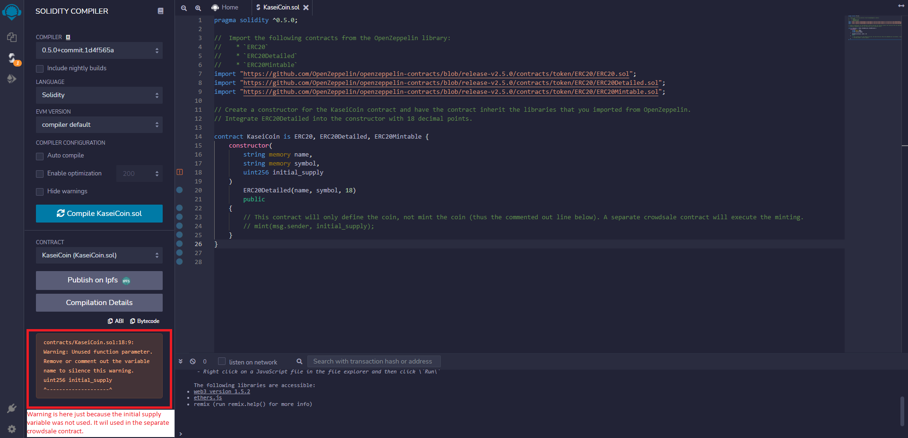

Next, a smart contract was created for the crowdsale of the token. Crowdsale and MintedCrowdsale were imported from OpenZeppelin to inherit their functionality. This smart contract allows for minting of the new token when users send ETH to the contract. The screenshot below shows the successful compilation of the contract. 

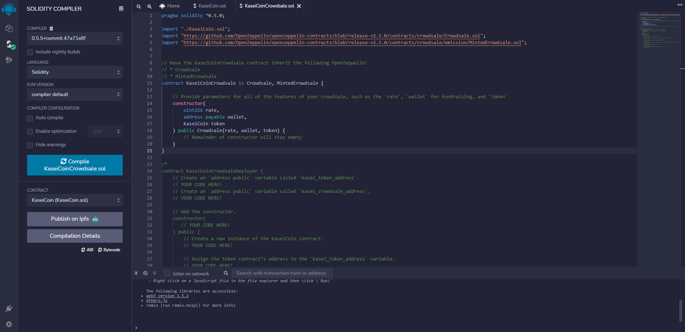

In the same solidity file as the crowdsale contract, a third contract was created to simply deploy the first two contracts. When it's executed, it stores the addresses for the locations of the first two smart contracts for easy loading in the Remix IDE instead. This saves the deployer from needing to deploy all three contracts and can do it in a single step. The screenshot below shows the successful compilation of the contract. 

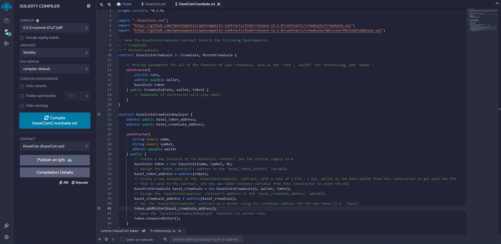

### Deployment

Once the three contracts were compiled successfully, the Crowdsale deployer contract was deployed to the Ganache local blockchain. The successful contract deployment, view of each contract, and the verification of the transaction (i.e., the smart contract deployment) are shown in the screenshots below.

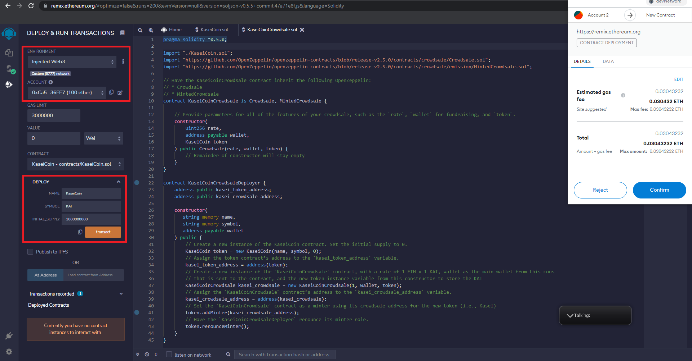

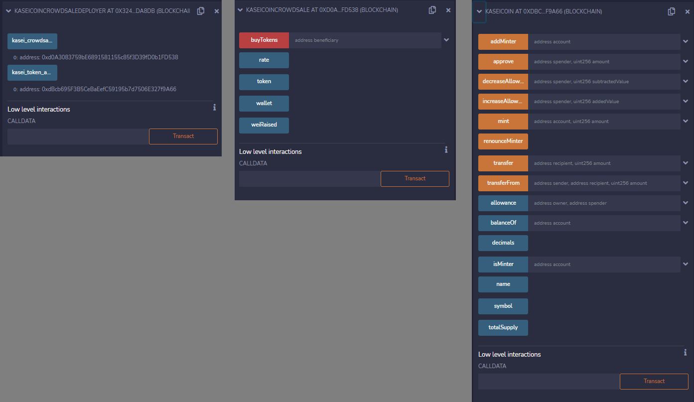

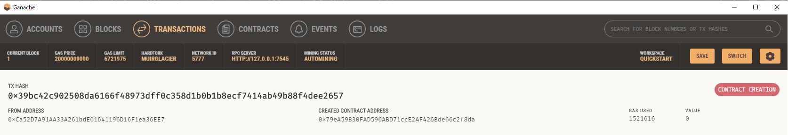

### Testing

With the contracts deployed, real-world testing of the functionality (e.g., buying new tokens, minting, checking total supply) of the crowdsale was performed. Three Ganache wallet addresses (each loaded with 100 ETH initially) were connected to MetaMask for testing. The screenshot below shows the three wallets initially loaded into MetaMask. For the purposes of testing, Account 2 (0x33fBB507E405ab20D11F36Aca11d67Be125f2C01) will serve as the deployer/owner of the contract who receives all the funds from the crowdsale. Accounts 3 (0x72837fc2026c76dD03147289A434126c7945Fdc4) and 4 (0xA506B79908489f9fcCEbe9B11f124cf84de119B4) will serve as users who are sending ETH to receive KAI as part of the crowdsale.

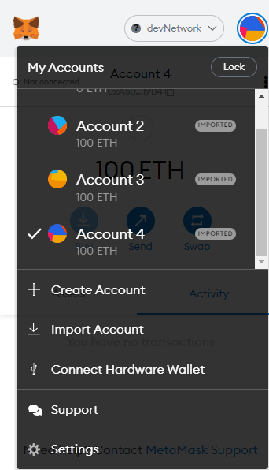

First, it was verified that the initial supply was zero and that the original deployer/owner could not mint any tokens, as shown below. Only the Crowdsale smart contract has the capability to mint tokens.

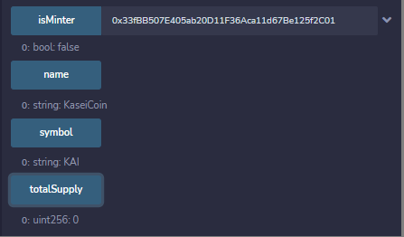

Next, Account 3 purchased 10 ETH worth of KAI. The total minted supply, Account 3's KAI balance in Remix IDE, and the ETH balances of Account 3 and 2 were verified to be properly adjusted according to the transaction, as shown below.

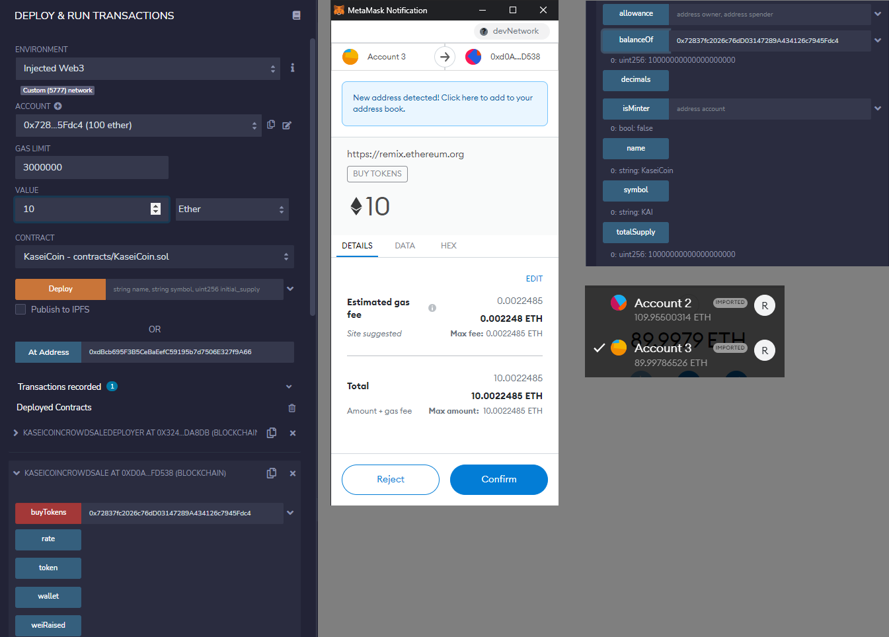

A similar transaction was executed with Account 4, but this time 50 ETH were purchased. As shown in the screenshots below, the total minted supply, Account 4's KAI balance in Remix IDE, and the ETH balances of Account 4 and 2 were verified according to the transaction details.

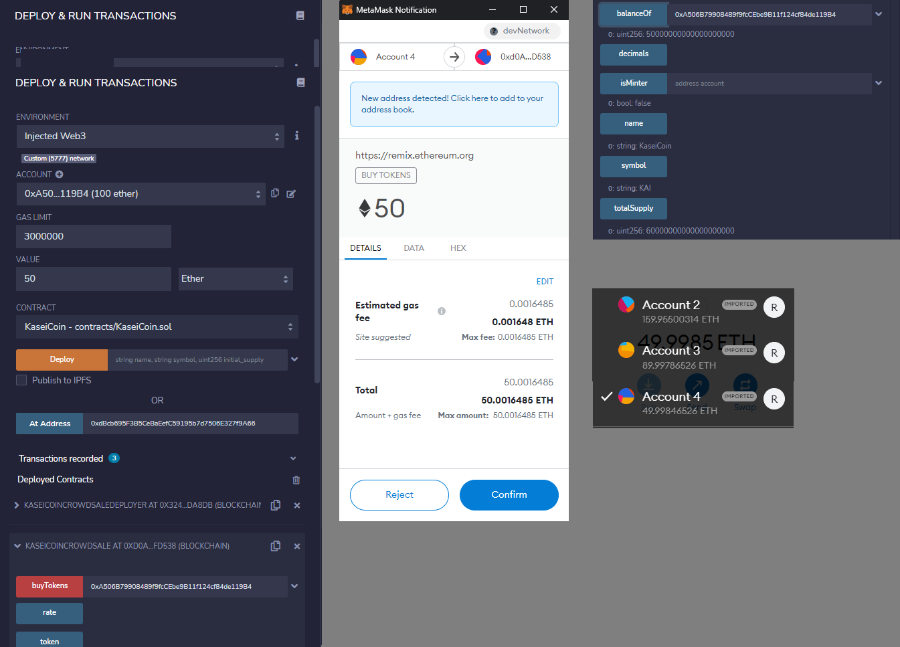

After the 10 ETH and 50 ETH transactions were executed (60 ETH total), the total Wei raised was verified.

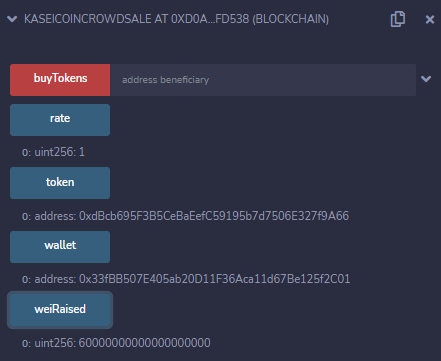

Finally, the low level transaction (i.e., fallback function) of the Crowdsale smart contract was tested to purchase KAI. As shown below, Account 3 was used to purchase 30 ETH using this method. There is no fallback function for the contract that simply defines KAI, so if it's used there is an error that is sent to the user.

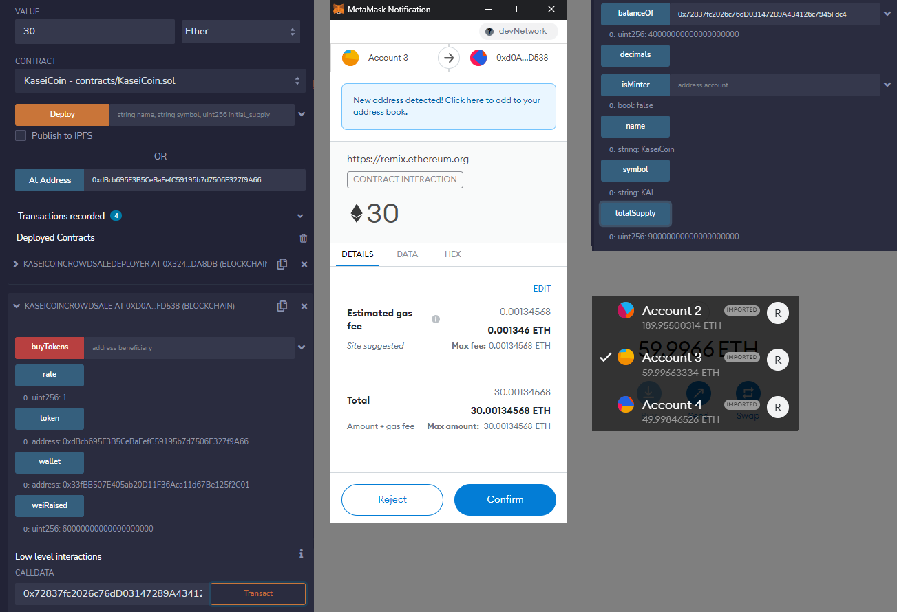